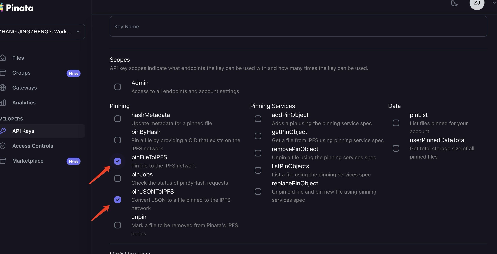
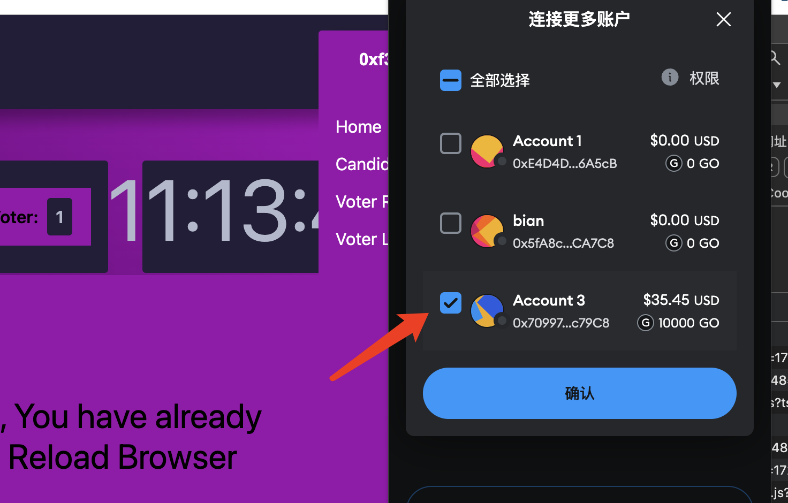
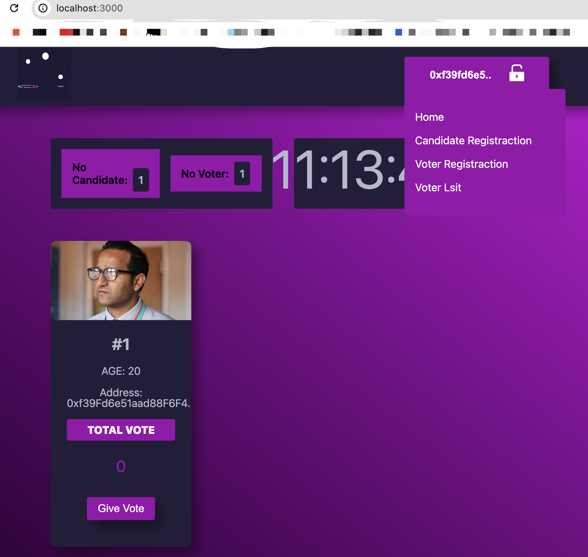

# Voting

## 业务介绍

### 角色

- 投票人
- 候选人
- 管理员

### 场景

- 管理员创建候选人和投票人
- 拥有投票权限的人可以对候选人进行投票
- 每个投票人只有一次投票机会，投票后会被标记voted

## 项目部署

### 本地部署和环境配置

#### 项目环境准备
1. 安装node.js   https://nodejs.org/zh-cn 

   安装yarn   `sudo npm install -g yarn`

2. [创建pinata账号](https://app.pinata.cloud/)
    （创建pinata账号使用ipfs服务用于投票中上传候选人和投票人照片）
3. [创建apikey](https://app.pinata.cloud/developers/api-keys)
    

    选择下面两个服务，创建apikey
    

    保存你的JWT（项目用）、apikey、api_secret
    
4. 配置JWT
    把JWT写到./context/JWT.js中

#### 项目配置
1. 依赖安装 `yarn install`
2. 启动本地链 `npx hardhat node`
3. 部署合约（本地） 【这步骤生产环境中用管理员账号进行部署】
    
    `npx hardhat run ./scripts/deploy.js --network localhost`
    
    部署后控制台打印合约地址，初次部署是这个地址：
    0x5FbDB2315678afecb367f032d93F642f64180aa3
    
    把这个地址写到`./context/constants.js`下的VotingAddress中

    `./context/constants.js`页面最底部的networkName，填入你使用的网络地址
4. 启动前端  `yarn dev`
    

### 流程
1. 管理员创建合约（上一步部署合约已经执行）
2. [管理员账号]创建candidate【allow-candidate页面】,上传图片，填写[候选人]信息（地址可以使用hardhat node初始提供的地址）默认创建合约的地址为
0xf39Fd6e51aad88F6F4ce6aB8827279cffFb92266

http://localhost:3000/candidate-regisration

3. [管理员账号]创建voter【allow-voter页面】（一个voter只能投一次票）

http://localhost:3000/allowed-voters

可使用这个地址
0x70997970C51812dc3A010C7d01b50e0d17dc79C8

4. 切换到[投票人]账户

注意如果未连接过账户，需要点击小狐狸钱包右上角小地球连接[投票人]账户

5. 切换到主页对[候选人]投票

完成投票
